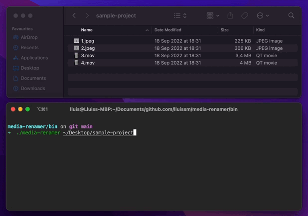

# media-renamer



Multiplatform cli tool to rename photos and videos according to its creation date (the creation date of the picture/video present in its exif metadata, not the file creation date that can change every time you download the pictures from the cloud).

Main usage:

- Have a common naming convention for all media regardless of the device that was used.
- Browse media in a chronological order by just sorting the files by their name.

This is especially useful when apps have problems interpreting the metadata for some file types and photos do not appear in the right order. After using the tool, you can just sort them by their name.

You can control for each file which exif keys should be scanned for date information.

_DISCLAIMERS:_

- Only tested in Mac OS and linux so far. Not tested in Windows yet.
- Only .jpeg and .mov file types have been configured so far (large library export from MacOS Photos app)

## How to use

### Syntax

```bash
$ media-renamer [-v] [-c config_file_path] folder_path
```

### Options

```
  -v        Provide detailed information during execution (optional)
  -c        Path to custom configuration file (optional)
  -version  Display version number (optional)
```

### Examples

With default configuration:

```bash
$ media-renamer -v ~/Documents/pictures
```

With custom configuration:

```bash
$ media-renamer -v -c my_config.yml ~/Documents/pictures
```

To show app version:

```bash
$ media-renamer -version
```

## How to configure

The configuration is done via [config.yml](cmd/media-renamer/config.yml) present in the source code.

```yml
- extension: ".mov"
  dateFields:
    - name: "CreationDate"
      dateFormat: "2006:01:02 15:04:05-07:00"
- extension: ".jpeg"
  dateFields:
    - name: "CreateDate"
      dateFormat: "2006:01:02 15:04:05"
```

It consists of a list of fileTypes with its extension and an array of dateFields from which the date could be obtained. The date is in [golang date format](https://go.dev/src/time/format.go).

There can be more than one per fileType and the first one that matches will be used to rename the file. In case of no match, the file name will not be modified.

A custom configuration can be provided via the `-c` flag. If not provided, the default one will be used.

## How to install

### Dependencies

The tool relies on [exiftool](https://exiftool.org) being installed on the device and added to the path.

An easy way to install in Mac OS is via homebrew:

```bash
$ brew install exiftool
```

An easy way to install in Ubuntu is:

```bash
$ sudo apt install exiftool
```

Instructions to install in all the platforms can be found on the official [website](https://exiftool.org) of the tool.

### Install script for media-renamer

For linux and MacOS systems you can use the install script.

To install the latest version:

```bash
$ curl -s https://raw.githubusercontent.com/lluissm/media-renamer/master/install.sh | bash
```

To install a specific version (e.g., v.1.3.0):

```bash
$ curl -s https://raw.githubusercontent.com/lluissm/media-renamer/master/install.sh | bash -s v1.3.0
```

### Binary packages

The binary packages for Linux, Windows and macOS are uploaded for each release and can be downloaded from the [releases](https://github.com/lluissm/media-renamer/releases) page.
